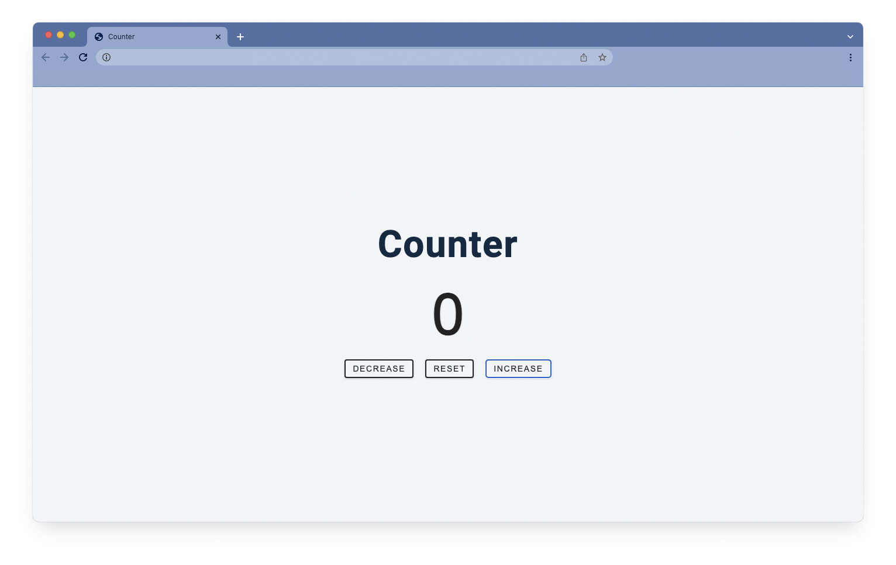

# 1109 스터디 TIL

## 오늘의 실습

> 출처: [Build 15 JavaScript Projects - Vanilla JavaScript Course](https://youtu.be/3PHXvlpOkf4?t=1826)

## 공부한 내용

`const btns = document.querySelectorAll(".btn");`

-   `querySelectorAll`은 여러개의 문서 객체를 배열로 읽어들임
-   `querySelectorAll`은 일반적으로 `forEach()` 메소드를 사용함

`btns.forEach..`

-   `querySelectorAll`에서 불러온 button 객체들을 담은 `btn`배열을 `forEach`를 통해 읽음

`btn.addEventListener("click", function (e) {...}`

-   `addEventListener`는 이벤트를 듣고 있는 함수를 더해주겠다는 의미
-   `("click", function (e){..}`의 의미는 `("event", eventhandler)`
    -   클릭이 발생하면 이벤트핸들러에 있는 내용을 실행해라~
    -   이벤트 핸들러 : 이벤트가 발생했을 때 실행되는 함수 -> 이벤트가 발생하면 이벤트 객체가 생성됨 -> 생성된 이벤트 객체가 `e`라는 파라미터에 할당됨

`const styles = e.currentTarget.classList;`

-   `currentTarget`는 이벤트가 부착된 부모의 위치를 반환함
-   `classList`는 클래스 이름을 반환
