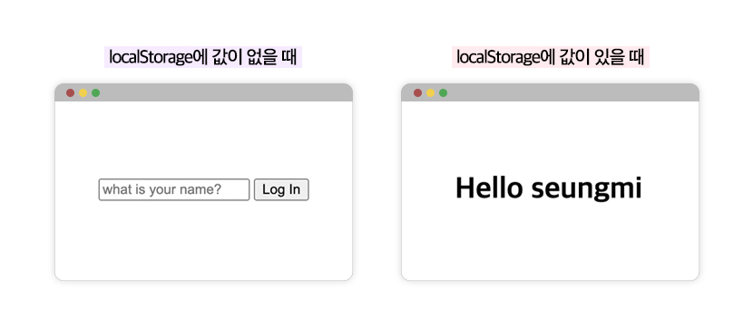

# 1110 스터디 TIL

## 오늘의 실습

> 출처: [바닐라 JS로 크롬 앱 만들기 Chapter3, 4 - Nomadcoders](https://nomadcoders.co/javascript-for-beginners/lobby)

## 공부한 내용

### chapter 3. DOM 조작하기

### DOM API

`document.getElementById(”id명”)`

-   html에서 getElementById 함수를 통해 (”id명”)값을 가진 element를 가져온다

`ocument.getElementsByClassName(”class명”)`

-   html에서 getElementsByClassName 함수를 통해 (”class명”)값을 가진 element를 가져온다. (단, class는 중복이 허용되어 배열 형태로 반환된다는 것을 기억할 것!)
-   해당 함수는 하위 요소까지 선택해서 가지고오지는 못함. 그래서 querySelector를 더 많이 사용하게 되는 것!

`document.getElementsByTagName(”tag명”)`

-   html에서 getElementsByTagName 함수를 통해 (”tag명”) 값을 가진 element를 가져온다. (단, 해당되는 태그가 여러개 있을 수 있어 배열 형태로 반환됨)

`document.querySelector(”선택자”)`

-   `document.querySelector(”선택자 태그”)` (선택자와 그 아래 하위요소까지 사용해서 자유롭게 원하는 element를 가져올 수 있는 장점이 있음)
-   선택자에 선택자 기호와 선택자명을 같이 써줘야 함
-   html에서 CSS 선택자에 해당하는 element를 하나만 반환함
    -   만약 해당되는 선택자가 여러개라면 첫번째 element만 가져옴

`document.querySelectorAll(”선택자”)`

-   조건에 맞는 선택자 element를 여러개 가지고 오고 싶을 때 사용
    -   배열로 반환함

### DOM Event

`console.dir()`

-   element의 내부를 보고 싶을 때
-   dir에 나온 element(object)들 중에 앞에 on이 붙은 건 모두 내장된 event들임

`addEventListener(”eventTpye”, functionName)`

-   `eventListener`

    -   JS에게 어떤 event를 listen하고 싶은지 알려줘야 함

-   `eventTpye`

    -   이벤트의 종류를 나타내는 문자열

-   `functionName` (이벤트 핸들러)
    -   이벤트가 발생했을 때 브라우저에 의해 호출될
        함수

`className`

-   이전 class들을 상관하지 않고 모든걸 교체해버림

`classList`

-   class들의 목록으로 작업할 수 있게 허용해줌(→ class의 정보를 담은 DOMTokenList 객체를 반환함)
    -   DOMTokenList는 컬렉션 객체로서 유사 배열 객체이면서 이터러블임
-   이 반환된 객체의 메서드들을 통해 class 어트리뷰트 값 조작이 가능함
    -   classList.contains(”className”)
        -   인수로 전달한 문자열과 일치하는 클래스가 class 어트리뷰트에 포함되어있는지 확인
    -   classList.toggle(”className”)
        -   class 어트리뷰트에서 인수로 전달한 문자열과 일치하는 클래스가 존재하면 제거하고, 존재하지 않으면 추가함

### chapter 4. LOGIN 화면 만들기

**localStorage API**

-   localStorage는 사용자의 브라우저가 가지고있는 작은 DB API라고 생각하자.

localStorage 확인하는 방법

-   개발자도구 - 어플리케이션 - 로컬스토리지

`localStorage.setItem(”key”, “value”)`

새로운 항목을 key:value로 추가

`lcoalStorage.getItem(”key”)`

저장된 정보를 불러오기(읽기)

`localStorage.removeItem(”key”)`

저장된 정보를 삭제하기

`localStorage.clear()`

저장된 정보 전체 삭제하기

## 느낀점

강의 듣는데만 2시간 가까이 소요되서 결국 주말동안 다시 듣고 정리하느라 고생아닌 고생을 겪었다. 이유는 챕터4부터 보다보니 강의 전체적으로 앞에서부터 쌓아온 DOM에 대한 지식 빌드업이 없었기에 챕터4에 대한 이해도가 매우 낮았던게 원인이었다. 결국 챕터3~4를 다시 보게됐고, 이렇게 강의를 여러번 돌려본 적이 오랜만이었다는 생각이 든다. 그래도 DOM을 어떻게 조작하는지 조금의 기초를 닦은 기분이라 만족! (다음번에는 빡시게 집중해서 빨리 끝내자)
