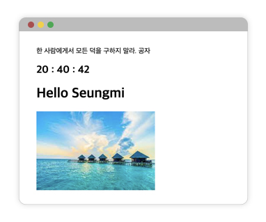

# 1114 스터디 TIL

## 오늘의 실습

> 출처: [바닐라 JS로 크롬 앱 만들기 Chapter5, 6 - Nomadcoders](https://nomadcoders.co/javascript-for-beginners/lobby)



## 공부한 내용

### chapter 5. 시계 화면 만들기

### Date() 객체

-   날짜를 저장할 수 있고, 날짜와 관련된 메서드를 제공해주는 내장 객체
-   객체 생성

    ```js
    let now = new Date();
    alert(now); // 현재 날짜 및 시간이 출력됨
    ```

-   인스턴스 메서드

    -   FullYear(), Month(), Date(), Hours(), Minutes(), Seconds(), Miliseconds()
    -   설정할 때는 `set메서드()`, 값을 반환받을 때는 `get메서드()`
    -   Date객체의 Month 개념은 zero-indexed 기반이라서 0부터 시작됨(0이 1월)
        ```js
        const date = new Date();
        const hours = date.getHours();
        const minutes = date.getMinutes();
        const seconds = date.getSeconds();
        clock.innerText = `${hours} : ${minutes} : ${seconds}`;
        ```

-   Date객체엔 자동 고침(autocorrection) 이라는 유용한 기능이 있음. 범위를 벗어나는 값을 설정하려고 하면 자동 고침 기능이 활성화되면서 값이 자동으로 수정됨!

    ```js
    let date = new Date(2013, 0, 32); // 2013년 1월 32일은 없습니다.
    alert(date); // 2013년 2월 1일이 출력됩니다.
    ```

### String.prototype.padStart()

```js
    str.padEnd(targetLength [, padString])
```

-   `targetLength`
    -   목표 문자열 길이. 현재 문자열의 길이보다 작다면 채워넣지 않고 그대로 반환.
-   `padString`

    -   현재 문자열에 채워넣을 다른 문자열. 문자열이 너무 길어 목표 문자열 길이를 초과한다면 좌측 일부를 잘라서 넣음. 기본값은 " ".

-   현재 문자열의 시작을 다른 문자열로 채워, 주어진 길이를 만족하는 새로운 문자열을 반환함

-   채워넣기는 대상 문자열의 시작(좌측)부터 적용됨
-   `padEnd()`는 현재 문자열에 다른 문자열을 채워, 주어진 길이를 만족하는 새로운 문자열을 반환함
    ```js
    String(date.getSeconds()).padStart(2, "0");
    ```

### setInterval() vs setTimeout()

-   무언가를 일정 간격을 두고 실행하도록 만들어주는 스케줄링 메서드
-   `setInterval()`
    -   `setInterval(func, delay)`
    -   두번째 인자로 전달받은 시간 간격으로 동작하는 타이머를 생성. 첫번째로 전달받는 콜백함수가 시간 간격을 두고 반복적으로 호출
-   `setTimeout()`
    -   `var timeoutID = setTimeout(function[, delay]);`
    -   함수는 두번째 인자로 전달받은 시간 변수(ms 단위, 1000이면 1초) 후 단 한번만 동작하는 타이머를 생성

<hr>

### chapter 6. 명언 및 배경화면(랜덤출력)

### Math.random()

-   0 이상 1 미만의 구간에서 근사적으로 균일한(approximately uniform) 부동소숫점 의사난수를 반환함
-   Math.random() 최대값 지정 : \*

    -   초기 범위 0~1이 아닌 최대 범위를 설정하려면, 곱하기 기호를 사용하면 됨

        ```js
        const chosenImage = images[Math.floor(Math.random() * images.length)];
        ```

### Document.createElement()

```js
let element = document.createElement(tagName[, options]);
```

-   지정한 tagName의 HTML 요소를 만들어 반환함

### Node.appendChild()

```js
let aChild = element.appendChild(aChild);
```

-   한 노드를 특정 부모 노드의 자식 노드 리스트 중 마지막 자식으로 붙임
